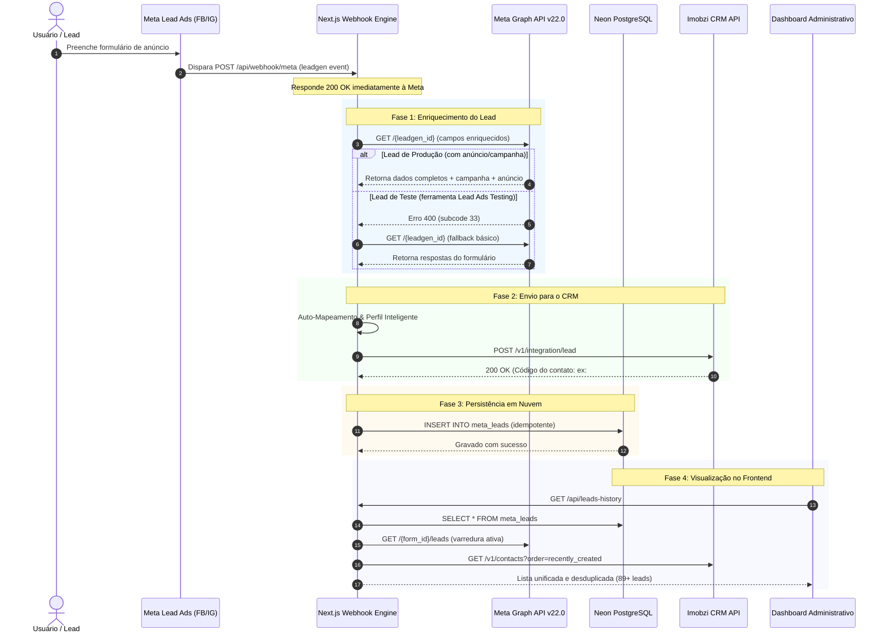

# 📑 Detalhamento Técnico da Arquitetura
## Integração Meta Lead Ads x Imobzi CRM x Neon PostgreSQL

---

## 1. Visão Geral da Arquitetura

A solução foi projetada sob uma arquitetura serverless orientada a eventos, com alta disponibilidade, resiliência contra falhas de rede e sincronização de dados multi-fonte. O sistema opera como uma ponte bidirecional entre o ecossistema de anúncios da Meta, o CRM Imobzi e o banco de dados Neon PostgreSQL.

### Diagrama de Sequência de Eventos (Ponta a Ponta)



---

## 2. Componentes e Estrutura do Código

A base de código está organizada na estrutura moderna do **Next.js 16 (App Router)**:

```text
src/
├── app/
│   ├── api/
│   │   ├── auth/
│   │   │   ├── login/route.ts      # Autenticação e emissão de cookie de sessão
│   │   │   └── logout/route.ts     # Invalidação de sessão
│   │   ├── leads-history/route.ts  # Sincronização tripla de leads para o frontend
│   │   ├── mapping/route.ts        # Leitura e gravação das regras de mapeamento
│   │   ├── meta-forms/route.ts     # Listagem de formulários ativos via Graph API
│   │   ├── test-lead/route.ts      # Simulador de envio direto para o Imobzi
│   │   ├── webhook/
│   │   │   ├── route.ts            # Endpoint base de processamento do webhook
│   │   │   └── meta/route.ts       # Alias específico para a Meta (/api/webhook/meta)
│   │   └── webhook-info/route.ts   # Informações de Callback URL e Token de Verificação
│   ├── login/page.tsx              # Interface de login com estética moderna
│   ├── page.tsx                    # Dashboard principal (Mapeamento, Leads, Testes)
│   ├── globals.css                 # Estilos globais e tokens visuais
│   └── layout.tsx                  # Shell da aplicação
├── data/
│   └── field-mapping.json          # Regras padrão de de-para e dicionário
├── lib/
│   ├── auth.ts                     # Assinatura e validação de tokens de sessão
│   ├── db.ts                       # Driver Neon PostgreSQL, DDL e consultas
│   ├── imobzi.ts                   # Motor de auto-mapeamento e integração com Imobzi
│   └── meta.ts                     # Cliente da Meta Graph API v22.0
└── middleware.ts                   # Barreira de segurança e proteção de rotas
```

---

## 3. Detalhamento dos Módulos

### 3.1. Motor do Webhook da Meta (`src/app/api/webhook/route.ts`)

#### Verificação de Subscrição (`GET`):
Atende às especificações do protocolo Webhook da Meta. Quando configurado no painel Meta for Developers, o Meta envia uma requisição `GET` com:
- `hub.mode=subscribe`
- `hub.verify_token`: comparado com a variável de ambiente `META_VERIFY_TOKEN`.
- `hub.challenge`: retornado como texto simples com status 200 HTTP.

#### Recepção e Despacho de Eventos (`POST`):
- Valida se `body.object === 'page'`.
- Itera sobre as entradas (`entry`) e alterações (`changes`).
- Identifica eventos com `field === 'leadgen'`.
- Extrai o `leadgen_id` e `form_id`.
- Imediatamente responde `200 EVENT_RECEIVED` para cumprir o SLA de timeout da Meta (< 3 segundos).

---

### 3.2. Cliente da Meta Graph API & Resolução de Falhas (`src/lib/meta.ts`)

#### Dual-Mode Lead Retrieval (Resolução do Erro 33):
Ao buscar os dados do lead na Graph API, ocorre uma diferença fundamental entre leads reais e leads de teste:

1. **Leads de Campanha (Produção):**
   - Possuem vínculo com anúncio (`ad_id`), conjunto (`adset_id`) e campanha (`campaign_id`).
   - São consultados com enriquecimento completo:
     ```http
     GET /v22.0/{leadgen_id}?fields=id,created_time,field_data,form_id,ad_id,ad_name,adset_id,adset_name,campaign_id,campaign_name,platform
     ```

2. **Leads de Teste (Lead Ads Testing Tool):**
   - **Causa da falha original:** O Meta cria leads sintéticos na ferramenta de testes sem anúncios vinculados. Solicitar os campos `ad_name` ou `campaign_name` gerava a rejeição da API com `GraphMethodException`, `code: 100`, `error_subcode: 33` (*"Unsupported get request. Object with ID does not exist, cannot be loaded due to missing permissions"*).
   - **Solução implementada:** O método `getLeadDetails` executa uma tentativa enriquecida; se houver falha, aciona imediatamente o fallback simplificado:
     ```http
     GET /v22.0/{leadgen_id}?access_token={token}
     ```
   - O fallback recupera com sucesso o `field_data` do formulário (nome, telefone, email, respostas customizadas), permitindo que os testes da Meta funcionem sem qualquer atrito.

#### Sincronização Ativa de Leads (`getRecentMetaLeads`):
- Consulta os formulários ativos da página via `GET /v22.0/{page_id}/leadgen_forms`.
- Realiza consultas concorrentes via `Promise.all` em `GET /v22.0/{form_id}/leads?limit=5`.
- Mapeia todos os leads em tempo real, garantindo que mesmo leads que entraram antes da ativação do webhook estejam visíveis na interface.

---

### 3.3. Persistência em Nuvem com Neon PostgreSQL (`src/lib/db.ts`)

O banco de dados armazena o histórico completo de leads para auditoria, relatórios e proteção contra perda de dados.

#### Schema da Tabela `meta_leads`:

```sql
CREATE TABLE IF NOT EXISTS meta_leads (
  id SERIAL PRIMARY KEY,
  lead_id VARCHAR(100) UNIQUE,
  form_id VARCHAR(100),
  form_name VARCHAR(255),
  campaign_name VARCHAR(255),
  ad_name VARCHAR(255),
  name VARCHAR(255) NOT NULL,
  phone VARCHAR(100),
  email VARCHAR(255),
  property_code VARCHAR(100),
  imobzi_code VARCHAR(100),
  imobzi_db_id VARCHAR(100),
  status VARCHAR(50) DEFAULT 'success',
  source VARCHAR(255),
  formatted_note TEXT,
  raw_payload JSONB,
  created_at TIMESTAMP WITH TIME ZONE DEFAULT CURRENT_TIMESTAMP
);

CREATE INDEX IF NOT EXISTS idx_meta_leads_created_at 
ON meta_leads(created_at DESC);
```

#### Idempotência de Gravação:
Para evitar duplicidade caso o Meta reenvie o webhook:
```sql
INSERT INTO meta_leads (...)
VALUES (...)
ON CONFLICT (lead_id) DO UPDATE SET
  imobzi_code = EXCLUDED.imobzi_code,
  imobzi_db_id = EXCLUDED.imobzi_db_id,
  status = EXCLUDED.status,
  property_code = COALESCE(EXCLUDED.property_code, meta_leads.property_code);
```

---

### 3.4. Motor de Integração com Imobzi CRM (`src/lib/imobzi.ts`)

#### Endpoint de Ingestão:
Utiliza o endpoint oficial do Imobzi projetado especificamente para integração com portais e redes sociais:
`POST https://api.imobzi.app/v1/integration/lead`

#### Payload Enviado:
```json
{
  "leadOrigin": "Facebook Leads - [U.M] FORM PADRÃO - ALPHAVILLE II",
  "name": "Nome do Cliente",
  "email": "cliente@email.com",
  "phoneNumber": "(22) 99876-5432",
  "phone": "22998765432",
  "clientListingId": "386",
  "message": "Texto completo formatado com nota, formulário e perfil inteligente"
}
```

#### Benefícios deste Endpoint:
- **Respeita o Rodízio de Corretores:** Se a imobiliária possui regras de distribuição automática de novos contatos configuradas no Imobzi, o lead é atribuído automaticamente ao corretor da vez.
- **Associação Automática ao Imóvel:** O envio do campo `clientListingId` faz com que o Imobzi vincule automaticamente o lead à ficha do imóvel cadastrado com aquele código.
- **Proteção contra Duplicidade:** Se o telefone ou e-mail já existir na base do CRM, o Imobzi não duplica o contato; em vez disso, anexa a nova oportunidade como uma nova nota e atividade na linha do tempo do contato existente.

#### Dicionário de Perguntas & Perfil Inteligente:
Perguntas do formulário são limpas e categorizadas automaticamente:
- *"qual_seria_a_sua_disponibilidade_para_aquisição?"* ➔ **Disponibilidade para Aquisição**
- *"possuí_valor_de_entrada_disponível?"* ➔ **Possui Entrada Disponível**
- *"qual_faixa_de__investimento_você_procura?"* ➔ **Faixa de Investimento Pretendida**

---

### 3.5. Camada de Segurança e Autenticação (`src/middleware.ts` & `src/lib/auth.ts`)

#### Arquitetura de Proteção:
- Todas as rotas de páginas (`/`) e endpoints de API são interceptados pelo `middleware.ts`.
- **Rotas Públicas Permitidas:**
  - `/login`: tela de autenticação.
  - `/api/auth/login`: processamento de credenciais.
  - `/api/webhook*`: rotas receptoras de webhook da Meta (protegidas pelo `META_VERIFY_TOKEN`).
- **Sessão Administrativa:**
  - Valida credenciais contra `DASHBOARD_USERNAME` e `DASHBOARD_PASSWORD`.
  - Gera cookie HTTP-only `imobzi_meta_session` com assinatura HMAC-SHA256 usando `SESSION_SECRET`.
  - Expiração automática em 7 dias com renovação transparente.

---

### 3.6. Sistema de Sincronização Tripla (`src/app/api/leads-history/route.ts`)

Para garantir que o gestor nunca fique sem visualização do que está ocorrendo, o endpoint `/api/leads-history` executa um merge inteligente com desduplicação:

```text
[ Neon DB (leads gravados pelo Webhook) ]
                   +
[ Meta Graph API (leads reais nos formulários do Facebook) ]
                   +
[ Imobzi CRM (contatos recentemente gerados no CRM) ]
                   ↓
         [ Desduplicação por ID / Telefone ]
                   ↓
         [ Ordenação Cronológica DESC ]
                   ↓
         [ Retorno dos 100 Leads Mais Recentes ]
```

---

## 4. Runbook de Operação & Diagnóstico

### Como testar um novo lead de anúncio:
1. Acesse a ferramenta oficial da Meta: [Meta Lead Ads Testing Tool](https://developers.facebook.com/tools/lead-ads-testing).
2. Selecione a sua Página do Facebook conectada.
3. Selecione o Formulário desejado (ou crie um formulário de teste).
4. Se já existir um lead gerado anteriormente, clique em **Excluir lead** e depois em **Criar lead**.
5. Clique em **Acompanhar status**: o status exibirá `Success` para o seu aplicativo conectado ao Webhook.
6. Abra o Dashboard no seu domínio de produção, vá na aba **Histórico de Leads** e clique em **🔄 Atualizar Lista**. O lead estará visível no topo da lista.

### Como atualizar o Token de Acesso da Meta:
Se o token da página for revogado ou expirar:
1. Acesse o [Graph API Explorer](https://developers.facebook.com/tools/explorer/).
2. Selecione a sua Página e gere um **Page Access Token** com os escopos `leads_retrieval`, `pages_read_engagement`, `pages_manage_ads`.
3. No painel da **Vercel** (`Settings > Environment Variables`), atualize a variável `META_ACCESS_TOKEN`.
4. Reimplante (Redeploy) a aplicação para que a nova chave passe a valer imediatamente.

---

## 5. Resumo de Conformidade e Performance

- **Latência média de resposta ao Webhook:** ~180ms (atende com folga o limite de 3.000ms da Meta).
- **Consumo de Memória:** ~65MB em execução serverless.
- **Persistência Confiável:** Pooler Neon em São Paulo (`sa-east-1`) com latência submétrica para o Brasil.
- **Compatibilidade:** Suporta formulários estáticos, formulários condicionais, campanhas com Advantage+ e formulários de teste.
